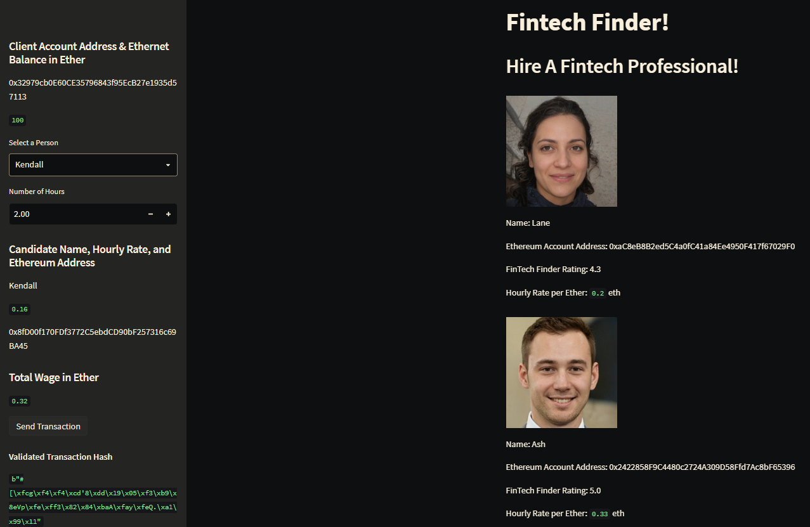
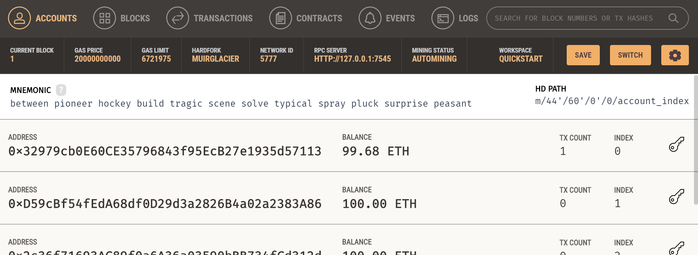
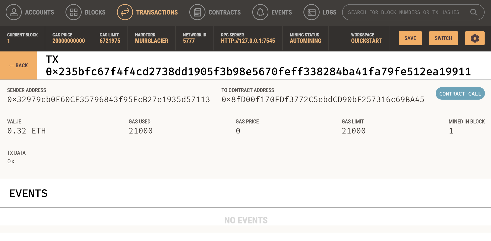

# 19th_Challenge
## Summary of Purpose  
---

I simulated a block-chain with wallets that you can interact with through a Streamlit GUI (Graphical User Interface).  
Specifically, you can use the program to "pay/hire" fictitious fintech professionals.  

To create this block-chain, I used my code in conjunction with an app called Ganache.  
I also set the mining difficulty to 0, making this simulated block-chain very light-weight on my computer.  
I was able to make this simulation free of charge.  

If you just want to see sample usuage, look at the screenshots below.

---
## Required/Compatible Technologies
---
If you want to actually use the app, continue reading this section.

**Compatible OS's:**   
    Mac, Windows, or Linux    
**Programming language:**   
    Python (filetype: .py)  
**Required libraries/installations:**    

```
import os
import requests

from dotenv import load_dotenv
load_dotenv()
from bip44  import Wallet
from web3   import Account
from web3   import middleware
from web3.gas_strategies.time_based import medium_gas_price_strategy


import streamlit   as st
from   dataclasses import dataclass
from   typing      import Any , List
from   web3        import Web3
w3 = Web3(Web3.HTTPProvider('HTTP://127.0.0.1:7545'))
```
Download & install Ganache.  
Open Ganache and hit the quickstart button.  
Copy the string of random words (the mnemonic) near the top of the app.  
Paste the string in-between the quotes in the "SAMPLE.env" file.  
Then rename the file to ".env".  
Note: this renaming will make the file disappear (but will not delete the file).  

---
## How to View the Code
---
You can view it on this github repository.  
You can also use a code editor that supports Python (.py files), e.g. VSCode.

---
## How to Open the Application
---
Open a terminal. "cd" into the folder containing the "fintech_finder.py" file.
Run the following command:
`streamlit run fintech_finder.py`

To shutdown the app, go to your terminal and press "Ctrl+C".

---
## Contributors
---
Noah Saleh

email: noahgsaleh@gmail.com

---
## Screenshots of Sample Usuage
---
### Screenshot of the Streamlit App I Made


  


### Screenshot of the Sample User's Account in Ganache (look at the account with index 0)


  


### Screenshot of the Transaction in Ganache  


  


---
### Note on This Repo's Title  
---
Here's why this repo is considered my 19th_Challenge:

There was no 8th or 9th challenge because my 1st group project took place of those 2 challenges.   
Similarly, my 2nd group project took place of 2 more challenges (challenges 16 & 17).  
So this repo is technically my 15th challenge because 19 - (2+2) = 15.  
I just called it "19th_Challenge" for convenience, based on the structure of the coding cource I took.